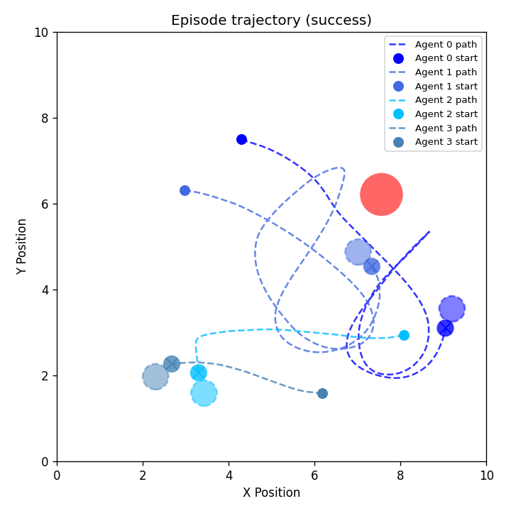
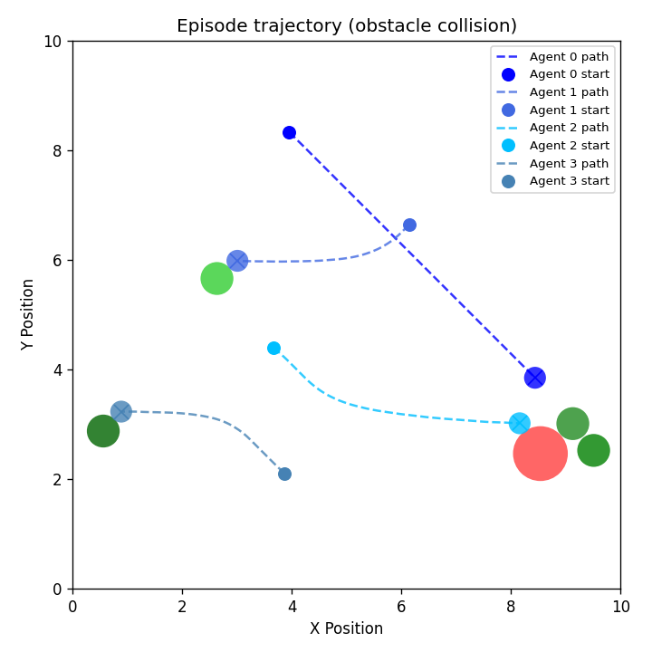
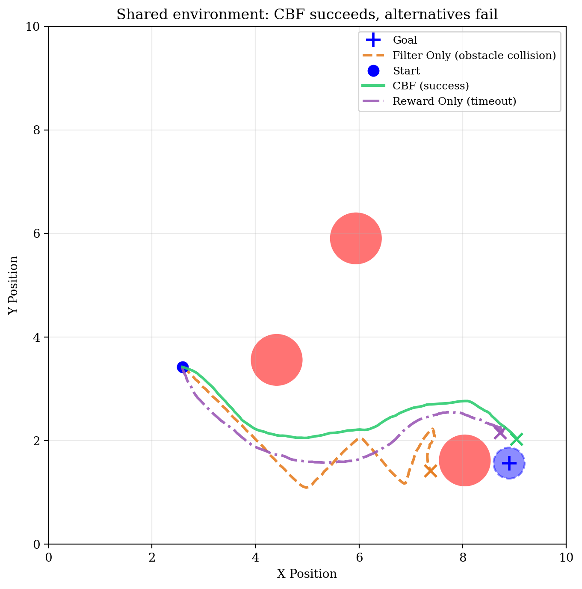
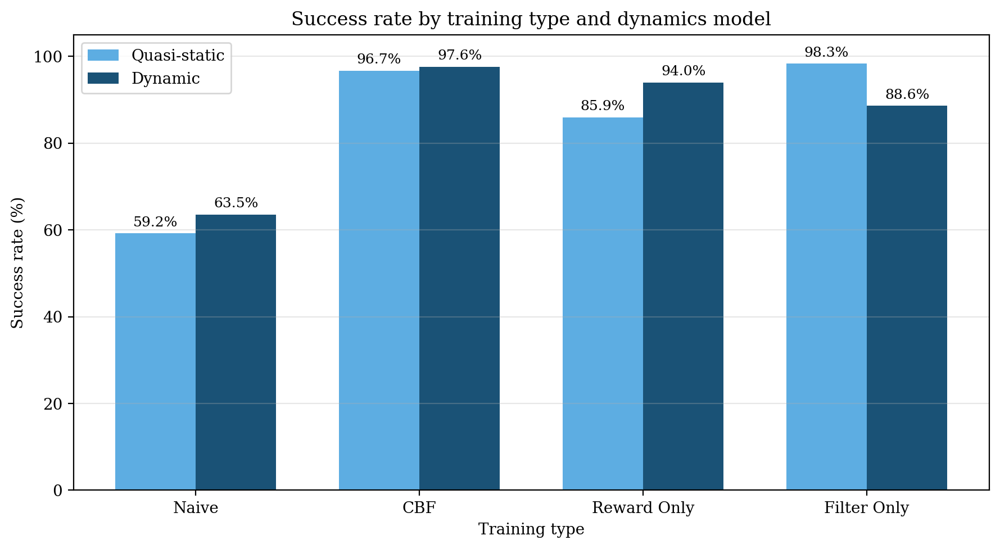
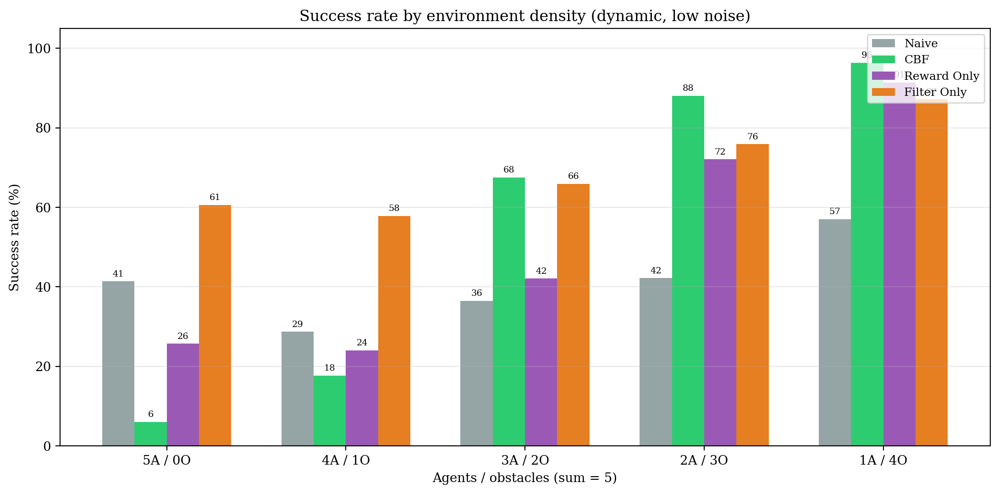
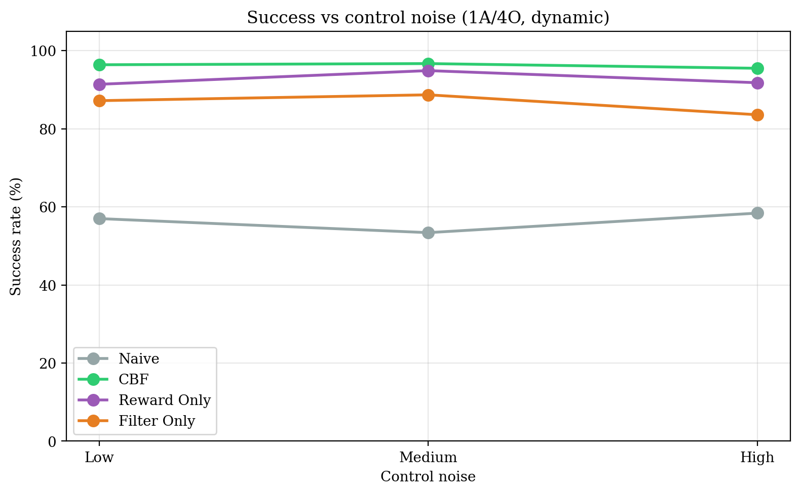
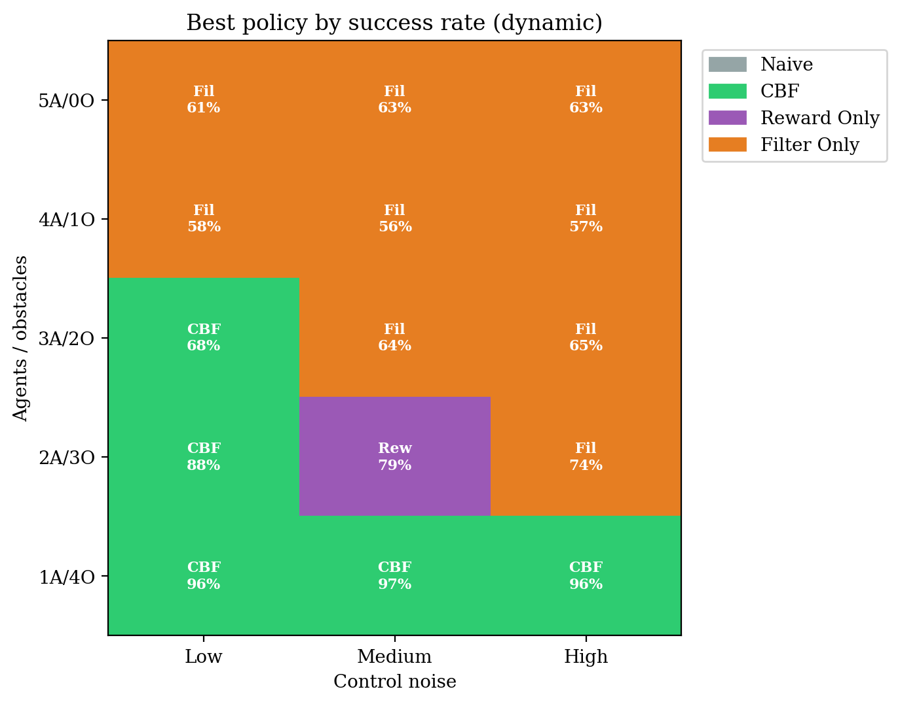

# CBF-RL for Dynamic, Multi-Agent Navigation

By Hisham Bhatti and Joshua Ng

A massively parallel reinforcement learning environment for training point-robot navigation policies under Control Barrier Function (CBF) safety constraints. We extend the [CBF-RL framework](https://arxiv.org/abs/2510.14959) from single-agent, velocity-controlled navigation to **multi-agent**, **double-integrator** dynamics with **stochastic control noise**, and run a full ablation over four training modes.

<table align="center">
  <tr>
    <td align="center">
      <br>
      Dual (CBF) Policy
    </td>
    <td align="center">
      <br>
      Naive Policy
    </td>
  </tr>
</table>

Here is the link to a [poster](CSE579_Poster_HB_JN.pdf) highlighting our findings.

## Motivation

Reinforcement learning can often prioritize performance at the expense of safety, which can be catastrophic in the real world. Consider applications in medicine, homes, or cities where humans are exposed and often at risk. Control Barrier Functions provide a formal way to keep the robot inside a safe set by filtering proposed actions before execution.

Yang et al. [1] propose a dual CBF-RL approach that combines two mechanisms during training:

1. Safety filter: project the policy's proposed action onto the CBF-feasible set before execution.
2. CBF reward penalty: penalize the policy (via large negative reward) when its raw proposal would violate the barrier constraint.

<p align="center">
  
</p>

We test whether this framework generalizes to multi-agent navigation with double-integrator dynamics and stochastic control noise, meant to better represent real-world conditions. This repo implements that extension and systematically ablates which component (filter, reward, or dual) actually teaches the policy to behave safely.

---

## Four Training Modes (Ablation)

Each mode trains the same PPO policy architecture. Only the action pipeline and reward differ.

| Mode | Action executed | Reward signal | What the policy learns |
|------|-----------------|---------------|------------------------|
| **Naive** | `v_policy` (raw) | `r_nominal` only | Task reward only — no safety signal at all |
| **Reward Only** | `v_policy` (raw) | `r_nominal + r_cbf` | Gets penalized for unsafe proposals, but the bad action still executes |
| **Filter Only** | `v_safe` (filtered) | `r_nominal` only | Unsafe actions are silently corrected — no explicit "your proposal was bad" signal |
| **Dual (CBF)** | `v_safe` (filtered) | `r_nominal + r_cbf` | Both correction *and* explicit penalty — the policy internalizes the constraint |

Reward Only and Filter Only are almost opposites in what information reaches the policy:

- Reward Only tells the policy its proposal was bad but does not protect it from consequences.
- Filter Only protects it but does not tell it the proposal was bad (only an indirect signal via altered state trajectories).
- Dual (CBF) does both, which is why the policy actually learns to propose natively safe actions rather than relying on the filter at test time.

```bash
./train_naive.sh        # no filter, no CBF reward
./train_reward_only.sh  # no filter, CBF reward penalty
./train_filter_only.sh  # CBF filter, no CBF reward penalty
./train_cbf.sh          # CBF filter + CBF reward penalty (Dual)
```

---

## Installation

### Option A — Conda (recommended for GPU clusters)

```bash
conda env create -f environment.yml
conda activate cbf_learning
```

### Option B — Python venv (We used/tested this one)

```bash
python -m venv .venv
source .venv/bin/activate   # Windows: .venv\Scripts\activate
pip install -r requirements.txt
```

Requires Python 3.10+, PyTorch with CUDA, and qpth for differentiable QP-based CBF filtering. For CPU-only development, use `requirements_cpu.txt`.

---

## Quick Start

Default settings replicate the original single-agent, single-integrator demo, no extra flags needed:

```bash
# Train (headless, 4096 parallel worlds, 1500 PPO iterations)
./train_cbf.sh --headless

# Evaluate latest checkpoint (1000 episodes)
./test_cbf.sh --headless
```

All four policies:

```bash
./train_naive.sh --headless
./train_cbf.sh --headless
./train_filter_only.sh --headless
./train_reward_only.sh --headless

./test_naive.sh --headless
./test_cbf.sh --headless
./test_filter_only.sh --headless
./test_reward_only.sh --headless
```

Training logs and checkpoints → `logs/navigation_<env_type>/`  
Evaluation summaries and episode media → `results/results_<env_type>/`

Each training run writes `env_meta.json` next to its checkpoints. `test.py` reads this automatically so you usually do not need layout/dynamics flags when evaluating a run you just trained.

---

## Configuration Flags

Pass these to `train.py`, `test.py`, or any shell script (scripts forward `$@`):

| Flag | Values | Default | Description |
|------|--------|---------|-------------|
| `--dynamics_model` | `quasi_static`, `dynamic` | `quasi_static` | Velocity (single integrator) vs acceleration (double integrator) |
| `--obs_layout` | `legacy`, `current` | `legacy` | Observation key ordering (`last_velocity` vs `robot_vel`) |
| `--num_agents` | integer ≥ 1 | `1` | Multi-agent: other agents appear as dynamic obstacles |
| `--control_noise` | `low`, `medium`, `high` | `low` | Gaussian actuator noise after the CBF filter (std = 0.1 / 0.3 / 0.5 × max control) |
| `--load_run` | run folder name | latest | Which training run to evaluate |
| `--checkpoint` | e.g. `1499` | latest | Which checkpoint to load |
| `--save_video_interval` | integer | `100` | Save trajectory PNG + MP4 every N eval episodes (`0` = off) |

Examples:

```bash
# Double-integrator multi-agent training
./train_cbf.sh --headless --dynamics_model dynamic --num_agents 3

# Control-noise ablation
./train_cbf.sh --headless --control_noise high

# Evaluate a specific run with saved videos
./test_cbf.sh --headless \
  --load_run navigation_cbf_20260603_022256 \
  --checkpoint 1499 \
  --save_video_interval 100
```

<details>
<summary><strong>Why <code>obs_layout</code> matters (ignore, for older checkpoints)</strong></summary>

The flat observation vector is built by **sorting dict keys alphabetically**. Renaming `last_velocity` → `robot_vel` changes feature ordering and breaks old checkpoints.

| Layout | Sorted keys | Use with |
|--------|-------------|----------|
| `legacy` | `goal_pos`, `last_velocity`, `obstacles`, `robot_pos` | Original demo / pre-rename checkpoints |
| `current` | `goal_pos`, `obstacles`, `robot_pos`, `robot_vel` | New experiments after the rename |

</details>

---

## Results

68 experiments, 1000 eval episodes each. All numbers below are success rate (%). Plots in [`results/plots/`](results/plots/). Generated with `compare/compare_*.py`.

### Dynamics model (1A / 3O, low noise)

<p align="center">
  
</p>

| Policy | Quasi-static | Dynamic |
|--------|:-----------:|:-------:|
| Naive | 59.2 | 63.5 |
| Reward Only | 85.9 | 94.0 |
| Filter Only | 98.3 | 88.6 |
| **Dual (CBF)** | **96.7** | **97.6** |

**Conclusion:** Filter-only and reward-only have changes in performance, but dual CBF still performs best. For naive, failures are mostly obstacle collisions. CBF quasi-static fails almost entirely via timeout, dynamic adds a few obstacle hits. Reward Only sees the biggest dynamics swing, where quasi-static is timeout-dominated. Filter Only is hurt by dynamic as failures shift from timeout to obstacle collision (10.6%).


### Agent / obstacle density (dynamic, low noise)

<p align="center">
  
</p>

| Config | Naive | Reward Only | Filter Only | Dual (CBF) |
|--------|:-----:|:-----------:|:-----------:|:----------:|
| 1A / 4O | 57.0 | 91.4 | 87.2 | **96.4** |
| 2A / 3O | 42.2 | 72.1 | 75.9 | **88.1** |
| 3A / 2O | 36.5 | 42.1 | 65.9 | **67.5** |
| 4A / 1O | 28.7 | 24.0 | **57.8** | 17.7 |
| 5A / 0O | 41.4 | 25.7 | **60.6** | 6.0 |

**Patterns:** CBF and Reward Only improve sharply as obstacles increase (5A/0O is worst, 1A/4O is best — 6% → 96% for CBF). Naive stays flat at 30–57% with little structure. Filter Only is more stable (58–87%) but does not reach CBF peaks at 1A/4O. CBF at 5A/0O and 4A/1O is dominated by timeouts (~33–38%), not obstacles.

### Control noise (1A / 4O, dynamic)

<p align="center">
  
</p>

| Noise | Naive | Reward Only | Filter Only | Dual (CBF) |
|-------|:-----:|:-----------:|:-----------:|:----------:|
| Low | 57.0 | 91.4 | 87.2 | 96.4 |
| Medium | 53.4 | 94.9 | 88.7 | 96.7 |
| High | 58.4 | 91.8 | 83.6 | 95.5 |

**Patterns:** CBF holds ~95–97% across noise levels. Reward Only is similarly stable (91–95%), slightly best at medium noise. Filter Only drops at high noise (87% → 84%) as obstacle collisions rise. Naive is flat (53–58%); medium noise increases timeouts (8.4% vs ~2–5% at low/high). Noise matters less here than agent/obstacle density.

### Full grid (dynamic) — success rate by policy

Rows = agent/obstacle config (A/O sum to 5). Columns = control noise.

| | **Naive** | | | **Reward Only** | | | **Filter Only** | | | **Dual (CBF)** | | |
|---|:---:|:---:|:---:|:---:|:---:|:---:|:---:|:---:|:---:|:---:|:---:|:---:|
| **A/O** | low | med | high | low | med | high | low | med | high | low | med | high |
| 1A/4O | 57.0 | 53.4 | 58.4 | 91.4 | 94.9 | 91.8 | 87.2 | 88.7 | 83.6 | **96.4** | **96.7** | **95.5** |
| 2A/3O | 42.2 | 40.1 | 39.9 | 72.1 | 79.0 | 68.0 | 75.9 | 74.9 | 74.0 | **88.1** | 74.1 | 73.6 |
| 3A/2O | 36.5 | 35.9 | 34.9 | 42.1 | 39.4 | 37.4 | **65.9** | **64.0** | **64.6** | 67.5 | 29.2 | 42.2 |
| 4A/1O | 28.7 | 29.5 | 27.3 | 24.0 | 16.0 | 13.8 | **57.8** | **55.9** | **57.1** | 17.7 | 20.1 | 45.0 |
| 5A/0O | 41.4 | 42.5 | 35.9 | 25.7 | 1.1 | 9.3 | **60.6** | **62.7** | **63.1** | 6.0 | 3.4 | 17.9 |

<p align="center">
  
</p>

**High-level patterns**

- **Filter Only** is the most consistent overall (~69% grid mean); wins **9/15** conditions; strong at high agent counts, weaker at 1A/4O.
- **Dual (CBF)** peaks highest in individual cells (~97% at 1A/4O) but collapses at high agent counts (timeouts dominate); grid mean ~52%.
- **Reward Only** tracks CBF in obstacle-heavy configs but struggles as agents grow.
- **Naive** never wins a condition; low noise sensitivity, moderate density sensitivity.

### Episode videos

| Dual (CBF) — success | Naive — collision |
|:---:|:---:|
| <video src="results/figs/videos/navigation_cbf_20260603_030218_0005_success.mp4" controls width="280"></video> | <video src="results/figs/videos/navigation_naive_20260603_011730_0055_obstacle_collision.mp4" controls width="280"></video> |

| Filter Only — success | Reward Only — collision |
|:---:|:---:|
| <video src="results/figs/videos/navigation_filter_only_20260603_041332_0025_success.mp4" controls width="280"></video> | <video src="results/figs/videos/navigation_reward_only_20260603_053734_0040_obstacle_collision.mp4" controls width="280"></video> |

More media: [`results/figs/pics/`](results/figs/pics/) · [`results/figs/videos/`](results/figs/videos/)

---

## Training & Monitoring

```bash
# Direct Python invocation
python train.py --env cbf --use_cbf_action_filtering --use_cbf_reward_penalty --headless

# TensorBoard
tensorboard --logdir logs/ --port 6006

# Plot mean episode reward across policies
python plot_tb_reward_log_steps.py \
    --cbf logs/navigation_cbf/.../events.out.tfevents... \
    --naive logs/navigation_naive/.../events.out.tfevents... \
    --only-cbf logs/navigation_filter_only/.../events.out.tfevents... \
    --soft-cbf logs/navigation_reward_only/.../events.out.tfevents... \
    --out-main logs/plots/mean_episode_reward.pdf
```

**Training setup:** PPO via [rsl-rl](https://github.com/leggedrobotics/rsl_rl) [4], 4096 parallel worlds, 48-step rollouts, 1500 iterations. MLP actor/critic `[obs_dim → 32 → 32 → action_dim]`, γ = 0.99, clip ε = 0.2, lr = 3×10⁻⁴.

---

## Acknowledgements

This project builds on [lzyang2000/cbf-rl-navigation-demo](https://github.com/lzyang2000/cbf-rl-navigation-demo) and extends it with multi-agent navigation, double-integrator dynamics, stochastic control noise, and a full evaluation/plotting pipeline.

Completed as part of CSE 579 (Deep Reinforcement Learning) at the University of Washington, Spring 2026. Thanks to Prof. Abhishek Gupta and Mateo Guaman Castro for their guidance.

---

## References

1. Luo Yang, Bryan Werner, Mateus de Sa, and Aaron D. Ames. **CBF-RL: Safety Filtering Reinforcement Learning in Training with Control Barrier Functions.** arXiv:2510.14959, 2025.
2. Quan Nguyen and Koushil Sreenath. **Exponential Control Barrier Functions for Enforcing High Relative-Degree Safety-Critical Constraints.** American Control Conference (ACC), 2016.
3. Liqian Wang, Aaron D. Ames, and Magnus Egerstedt. **Safety Barrier Certificates for Collisions-Free Multirobot Systems.** IEEE Transactions on Robotics, 33(3):661–674, 2017.
4. Nikita Rudin, David Hoeller, Philipp Reist, and Marco Hutter. **Learning to Walk in Minutes Using Massively Parallel Deep Reinforcement Learning.** Conference on Robot Learning (CoRL), 2022.
5. Aaron D. Ames et al. **Control Barrier Functions: Theory and Applications.** European Control Conference (ECC), 2019.
6. John Schulman et al. **Proximal Policy Optimization Algorithms.** arXiv:1707.06347, 2017.

**Further reading**

- [Control Certificates (UW LMC Book)](https://uw-ctrl.github.io/lmc-book/lectures/control-certificates.html)
- [Safety Gymnasium](https://safety-gymnasium.readthedocs.io/en/latest/introduction/about_safety_gymnasium.html)
